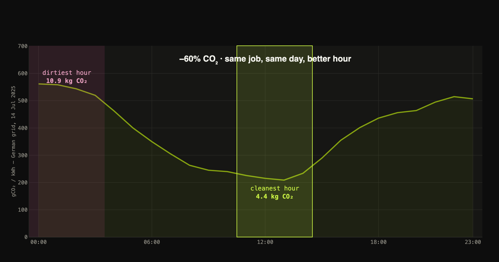

# carbonwatch — When Should a Computer Work?

**[Read the full data story →](https://zerisinyu.github.io/carbonwatch/)**



A deferrable compute job (an ML training run, a batch pipeline) doesn't have to
run *now* — it can run *whenever the grid is cleanest*. This project builds a
German carbon-intensity pipeline from scratch, forecasts it a day ahead, and
measures what that forecast is actually worth in avoided CO₂.

**Headline results** (2025 held-out year, 4h/5kW daily job, German grid):

| | vs. random start time |
|---|---|
| Scheduled by our forecast | **−28%** CO₂ |
| Scheduled with perfect foresight (ceiling) | −29% CO₂ |
| → forecast captures | **96%** of the theoretical saving |

The forecaster (LightGBM + ENTSO-E day-ahead wind/solar/load forecasts) beats a
seasonal-naïve baseline by **42%** on MAE. Our self-computed carbon intensity
correlates at **r = 0.992** with the independent Fraunhofer ISE (Energy-Charts)
reference series.

## What's here

- `src/carbonwatch/` — data pipeline: ENTSO-E (DE-LU) and NESO (GB) fetchers,
  carbon-intensity computation from generation mix, forecasting, scheduling simulation
- `notebooks/` — numbered, reproducible experiment scripts (run in order)
- `site/` — the Quarto narrative site (source for the published story above)
- `tests/` — unit tests

## Reproduce

```bash
uv sync
cp .env.example .env   # add your ENTSO-E API key (free, transparency.entsoe.eu)
uv run pytest

uv run python notebooks/01_uk_experiment.py    # UK forecast + scheduling sim
uv run python notebooks/02_de_pipeline.py      # DE carbon intensity + validation
uv run python notebooks/03_de_experiment.py    # DE forecast + scheduling sim
uv run python notebooks/04_descriptive.py      # heatmaps + DE-vs-UK spatial arm
uv run python notebooks/05_readme_figure.py    # this README's hero figure
```

Rebuild the site itself:

```bash
cd site && quarto render
```

## Data sources

- [ENTSO-E Transparency Platform](https://transparency.entsoe.eu/) — German generation by type, load, day-ahead forecasts
- [NESO Carbon Intensity API](https://carbonintensity.org.uk/) — GB carbon intensity + official forecast
- [Energy-Charts](https://energy-charts.info) (Fraunhofer ISE) — independent validation reference

## Method notes

Carbon intensity is computed from generation-mix data weighted by IPCC
lifecycle emission factors (documented, with known simplifications, in
[`src/carbonwatch/carbon_intensity.py`](src/carbonwatch/carbon_intensity.py)).
Forecasts are trained on 2024 and evaluated strictly out-of-sample on 2025;
exogenous day-ahead features are only attached for horizons where they would
genuinely have been published (see
[`src/carbonwatch/features.py`](src/carbonwatch/features.py)). Full write-up,
limitations (average- vs marginal-emissions, production- vs consumption-based
accounting), and the DE-vs-UK spatial comparison are in the
[site](https://zerisinyu.github.io/carbonwatch/).
